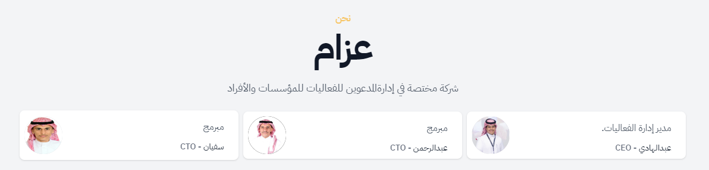

<h2 align="center">عزام</h2>
 

<h2 align="center">
انمو بسرعة ، وانجز الأمور بسهولة
 
إدارة المدعوين في أي وقت وأي مكان.
</h2>
   

شركة مختصة في إدارة المدعوين للفعاليات 

   
<h3 align="center">طريقة التثبيت</h3>
 

### djanog
- git clone https://github.com/azwri/azzam.git
- cd azzam
- python3 -m venv venv
- source venv/bin/activate
- pip install -r requirements.txt
- python3 manage.py runserver
### vue
- cd frontend
- npm install
- npm run dev